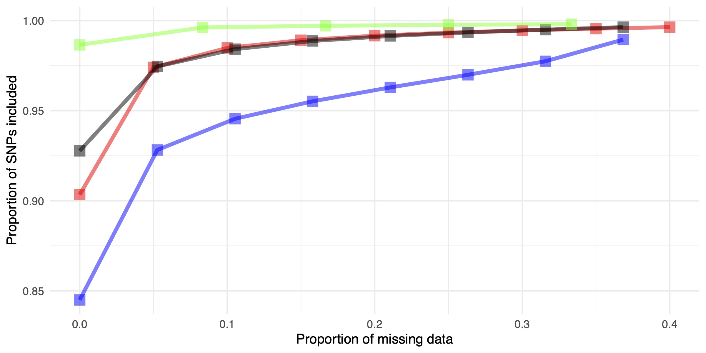

# Lynxtrogression
## Detecting Genomic Introgressions Among Lynx Lineages

In this repository you can find all of the workflows and scripts I wrote and ran in order to detect introgressed windows in the genomes of *Lynx pardinus* and *Lynx lynx* populations.

### Selecting Samples

The genomic dataset we used for the introgression scans was comprised of all of the individuals we have sampled from the following populations:

* *Lynx pardinus* :
  * Sierra Morena (N=29) = **lpa**

* *Lynx lynx* :
  * Western clade Kirov + Urals (N=20) = **wel**
  * Eastern clade Yakutia + Primorsky krai (N=19) = **eel**
  * Southern clade Caucasus (N=12 or N=9) = **sel**

The [populations table](data/lp_ll_introgression_populations.txt) has information on how to convert sample names to their population

| sample | population |
|:------:|:----------:|
| sm     | lpa        |
| ki     | wel        |
| ur     | wel        |
| ya     | eel        |
| vl     | eel        |
| ca     | sel        |

A [table](data/samples_table.xlsx) with each sample's species, population, original study, sequencing technology, median read depth can be found in the data folder. There I also marked which samples were used in which analysis.

### Alignment to reference genomes

From our previous work we have already generated BAM files for each of these samples ([Kleinmann-Ruiz et al. 2022](https://www.pnas.org/doi/abs/10.1073/pnas.2110614119) and [Bazzicalupo et al. 2023](https://onlinelibrary.wiley.com/doi/full/10.1111/eva.13570)), generated using the Canada lynx assembly as the reference genome ([mLynCan4_v1.p - GCA_007474595.1](https://www.ensembl.org/Lynx_canadensis/Info/Index); [Rhie et al., 2021](http://www.nature.com/articles/s41586-021-03451-0)).

Additionally I used sequences generated for the new Plan Nacional project. Libraries were generated by Lucía and Laura and sequenced by novogene *check with them for additional details*

#### Data Quality Control and Read Processing

I run [fastqc](https://www.bioinformatics.babraham.ac.uk/projects/fastqc/) to check the quality of rawreads from sequencing.

Seeing the warnings I receive from fastqc reports I need to process the rawreads to try to remove them.

I use [fastp](https://github.com/OpenGene/fastp) from [Chen et al. (2018)](https://academic.oup.com/bioinformatics/article/34/17/i884/5093234?login=true) with default settings plus the following flags:
```
--dont_overwrite (protect the existing files not to be overwritten by fastp)
--trim_poly_g (detect the polyG in read tails and trim them)
--length_required 30 (reads shorter than length_required will be discarded)
--correction (enable base correction in overlapped regions)
--detect_adapter_for_pe (enable adapter sequence auto-detection)
--thread 6 (worker thread number)
```

See [Lucia's github](https://github.com/luciamayorf/Data_preprocessing_alignment?tab=readme-ov-file#2-reads-trimming-and-quality-control) for how these scripts were run.

#### Run alignments

I align the my samples to the [Lynx canadensis reference genome](https://www.ensembl.org/Lynx_canadensis/Info/Index).

A script will be run for each sample that will use [bwa v0.7.17](https://bio-bwa.sourceforge.net/bwa.shtml), [samtools v1.9](https://www.htslib.org/doc/samtools.html), [picard v2.25.5](https://broadinstitute.github.io/picard/) and [gatk v3.7-0](https://gatk.broadinstitute.org/hc/en-us) that will do the following:
- Align each of the sample's R1-R2 fastq pairs to the reference genome using BWA-MEM and Samtools view
- samtools sort to sort the reads in the bam file
- picardtools AddOrReplaceReadGroups to add read groups to the reads in the bam file
- samtools merge to merge the bam files from the multiple R1-R2 pairs of the sample if necessary
- picardtools MarkDuplicates to mark duplicate reads in the bam
- realign indels with GATK which comprises:
    - gatk RealignerTargetCreator to identify realign targets
    - gatk IndelRealigner to realign the indels
- samtools index to index the indel realigned bam for downstream analyses

Scripts that will run the alignment pipeline [for each sample](src/print_samples_in_config.py) in the [alignment configuration file](config/alignments/all_fastp_alignment.yml) are generated using the [run_alignment](src/congenomics_fastq_align-main/run_alignment.py) python script with the flag `--test`:
```
cd scripts/alignments

for sample in $(python ../../src/print_samples_in_config.py ../../config/alignments/all_fastp_alignment.yml)
 do
  echo "generating alignment script of $sample"
  python ../../src/congenomics_fastq_align-main/run_alignment.py --sample $sample --config ../../config/alignments/all_fastp_alignment.yml --test
done
```
The generated scripts were then submitted to the job queue on cesga ft3:
```
# sbatch all except lr
for sh in $(ls scripts/alignments/*.sh)
 do
  echo "sbatching $sh"
  sbatch $sh
done
```

#### Alignment quality control

To check on the quality of alignments I run [QualiMap v2.2.1](http://qualimap.conesalab.org/) ([Okonechnikov et al. 2016](https://doi.org/10.1093/bioinformatics/btv566)) using the [run_qualimap_bam_out](src/alignments/run_qualimap_bam_out.sh) script.

```
# Sbatch QualiMap of all samples I want to check out
bams=$(ls /mnt/lustre/hsm/nlsas/notape/home/csic/ebd/jgl/lynx_genome/lynx_data/LyCaRef_bams/*er.bam | grep -E "ll|lp" | grep -E "ll_ca|lp_sm|ll_ya|ll_vl|ll_ki|ll_ur" | grep -vE "ca_0249|ca_0253")

for bam in ${bams[@]}
 do
  echo "sbatch qualimap of $bam"
  sbatch src/alignments/run_qualimap_bam_out.sh \
  ${bam} data/qualimap
done
```

Then I can summarize the results using [multiqc](https://multiqc.info/) ([Ewels et al. (2016)](https://academic.oup.com/bioinformatics/article/32/19/3047/2196507)).

```
cd data/qualimap
multiqc .
```

### Variant Calling using GATK

Variant calling was performed on the ft3 CESGA server.

```
ref_dir=/mnt/lustre/hsm/nlsas/notape/home/csic/ebd/jgl/reference_genomes/Lynx_canadensis_Ref
bam_dir=/mnt/lustre/hsm/nlsas/notape/home/csic/ebd/jgl/lynx_genome/lynx_data/LyCaRef_bams
gvcf_dir=/mnt/lustre/hsm/nlsas/notape/home/csic/ebd/jgl/lynx_genome/lynx_data/LyCaRef_gvcfs

scaffolds=$(cat ${ref_dir}/autosomic_scaffolds_list.txt)
ref=${ref_dir}/lc4.fa

# samples=(c_lp_sm_0220 c_lp_sm_0474 c_lp_sm_0614 c_ll_ki_0090 c_ll_ur_0202)
# samples=(c_ll_ya_0141 c_ll_ya_0146 c_ll_ca_0240 c_ll_ca_0243)

for sample in ${samples[@]}
 do
  inbam=$(ls ${bam_dir}/*er.bam | grep ${sample})
  
  for chr in ${scaffolds[@]}
   do
    
    bed=${ref_dir}/CHR_BEDs/${chr}_CHR_coordinates.bed
    outgvcf=${gvcf_dir}/${sample}.${chr}.g.vcf

    echo "sbatch call gvcf of $sample $chr"
    sbatch src/calling/call_gvcf_ref_bam_outgvcf_bed.sh \
    $ref \
    $inbam \
    $outgvcf \
    $bed
    
  done
done
```
Combine individual sample files of each chromosome into a unified file for each chromosome.
```
ref_dir=/mnt/lustre/hsm/nlsas/notape/home/csic/ebd/jgl/reference_genomes/Lynx_canadensis_Ref
gvcf_dir=/mnt/lustre/hsm/nlsas/notape/home/csic/ebd/jgl/lynx_genome/lynx_data/LyCaRef_gvcfs

scaffolds=$(cat ${ref_dir}/autosomic_scaffolds_list.txt)
ref=${ref_dir}/lc4.fa

for chr in ${scaffolds[@]}
 do
  echo "combining gvcfs of ${chr}"
  
  ls ${gvcf_dir}/*.${chr}.g.vcf > tmp_${chr}_gvcf.list
  
  sbatch src/calling/combine_gvcfs_ref_list_outgvcf.sh \
    $ref \
    tmp_${chr}_gvcf.list \
    ${gvcf_dir}/demo_inference.${chr}.g.vcf

done

rm tmp_*
```
Genotype the gvcf of each chromosome
```
ref_dir=/mnt/lustre/hsm/nlsas/notape/home/csic/ebd/jgl/reference_genomes/Lynx_canadensis_Ref
gvcf_dir=/mnt/lustre/hsm/nlsas/notape/home/csic/ebd/jgl/lynx_genome/lynx_data/LyCaRef_gvcfs

scaffolds=$(cat ${ref_dir}/autosomic_scaffolds_list.txt)
ref=${ref_dir}/lc4.fa

for chr in ${scaffolds[@]}
 do
  
  ingvcf=${gvcf_dir}/demo_inference.${chr}.g.vcf
  outgvcf=${gvcf_dir}/demo_inference.${chr}.genotyped.vcf
  
  echo "genotype gvcf of ${chr}"
  
  sbatch src/calling/genotype_gvcf_ref_ingvcf_outgvcf.sh \
    $ref \
    $ingvcf \
    $outgvcf

done
```
Concatenate the single chromosome VCFs into one
```
module load picard

gvcf_dir=/GRUPOS/grupolince/LyCaRef_gvcfs
vcf_dir=/GRUPOS/grupolince/LyCaRef_vcfs

# Create a VCF file list
ls ${gvcf_dir}/demo_inference.*.genotyped.vcf > data/calling/demo_inference.genotyped.vcf.list

# Concatenate chromosome VCFs into whole genome VCF
/opt/bcftools-1.6/bcftools concat \
  -f data/calling/demo_inference.genotyped.vcf.list \
  --output-type v \
  --output ${vcf_dir}/demo_inference.LyCa_ref.vcf \
  --threads 22

# Sort with bcftools sort:
/opt/bcftools-1.6/bcftools sort -O v \
  -o ${vcf_dir}/demo_inference.LyCa_ref.sorted.vcf \
  ${vcf_dir}/demo_inference.LyCa_ref.vcf

```

I made a list of the bams to be included in the calling:

```
# On CESGA FT3 server go to Canada lynx reference genome BAM files
cd /mnt/lustre/hsm/nlsas/notape/home/csic/ebd/jgl/lynx_genome/lynx_data/LyCaRef_bams

# Create a bamlist of samples from populations we want to include in our analysis
ls *er.bam | grep -E "ll|lp" | grep -E "ca|sm|ya|vl|ki|ur" | 
  grep -vE "ca_0249|ca_0253|sm_0138|sm_0140|sm_0185|sm_0186|sm_0221|sm_0298|sm_0359" \
  > lp_ll_introgression.bamlist
```

To generate a VCF file from these BAMs, we performed variant calling on each scaffold in parallel, while additionally dividing all of the bigger scaffolds (18 autosomic + X) into 80 chunks each. This way more jobs have to be sbatched, but we have no memory or time problems.

We called scaffolds that could be called without being divided into chunks using the script [perchr_haplotypecaller.sh](scripts/calling/perchr_haplotypecaller.sh)

```
# short non-autosomic (??) scaffolds 
chr_list=($(cat /mnt/lustre/hsm/nlsas/notape/home/csic/ebd/jgl/reference_genomes/Lynx_canadensis_Ref/non-autosomic_scaffolds_list.txt | grep -vE "mLynCan4_MT|Super_Scaffold_10"))
for chr in ${chr_list[@]}
 do
  echo "sbatching perchr_haplotypecaller for $chr"
  sbatch --mem=120GB perchr_haplotypecaller.sh $chr
done
```

Chunk divided scaffolds were then called using the script [perchunk_haplotypecaller.sh](./perchunk_haplotypecaller.sh)

```
# big autosomic scaffolds (only 10 at the time for cluster job submission limitations):
chr_list=($(cat /mnt/lustre/hsm/nlsas/notape/home/csic/ebd/jgl/reference_genomes/Lynx_canadensis_Ref/autosomic_scaffolds_list.txt))
for chr in ${chr_list[@]:0:10}
 do
  for i in {1..10}
   do
    echo "sbatching perchunk_haplotypecaller for $chr w $i"
    sbatch --mem=120GB perchunk_haplotypecaller.sh $chr $i
  done
done

# X chromosome (Super_Scaffold_10)
for i in {1..10}
 do
  echo "sbatching perchunk_haplotypecaller for Super_Scaffold_10 w $i"
  sbatch --mem=120GB perchunk_haplotypecaller.sh Super_Scaffold_10 $i
done
```

Resulting chunk and scaffold VCFs were concatenated using bcf-tools and then sorted

```
cd /mnt/lustre/hsm/nlsas/notape/home/csic/ebd/jgl/lynx_genome/lynx_data/LyCaRef_vcfs

# Create list of vcf files to concatenate
ls lp_ll_introgression_*caffold*.vcf | tr ' ' '\n' > lp_ll_introgression_vcfs.list

# Concatenate chromosome VCFs into whole genome VCF
bcftools concat -f lp_ll_introgression_vcfs.list \
 --output-type v \
 --output lp_ll_introgression_LyCa_ref.unsorted.vcf

# Sort with bcftools sort:
bcftools sort -O v -o lp_ll_introgression_LyCa_ref.sorted.vcf lp_ll_introgression_LyCa_ref.unsorted.vcf
```

### Standard Variant Filtering

The following variants were filtered from the VCF generated during the calling:

1. Variants from Repetitive/Low mappability regions (defined by the reference genome annotation)
2. Indels + Non-biallelic variants
3. Non-variant SNPs (allele frequency = 1)
4. and 5. Standard quality filters, as GATK standard practices

This was performed in the genomics-a server running a customized script [lp_ll_introgression_vcf_filters_1-5.sh](scripts/variant_filtering/lp_ll_introgression_vcf_filters_1-5.sh) that uses a combination of bedtools, bcftools and gatk.

New version
```
ref=/GRUPOS/grupolince/reference_genomes/lynx_canadensis/lc4.fa
invcf=/GRUPOS/grupolince/LyCaRef_vcfs/demo_inference.LyCa_ref.sorted.vcf
mask=/GRUPOS/grupolince/reference_genomes/lynx_canadensis/repetitive_regions/lc_rep_ALL_scaffold_coord.bed

bash src/variant_filtering/filter_1to5_ref_invcf_mask.sh \
  $ref \
  $invcf \
  $mask
```

An additional custom script [summary_table_filters_1-5.sh](scripts/variant_filtering/summary_table_filters_1-5.sh) was then run to extract a [table](data/variant_filtering/lp_ll_introgression_LyCa_ref.filters_1-5.log.csv) summarizing the filtering process, indicating how many variants are present at the start of each step (e_vars) and how many variants were filtered at each step.

| step | name        | e_vars   | f_vars   |
|------|-------------|----------|----------|
| 0    | start       | 23406903 | 0        |
| 1    | low_map     | 11705070 | 11701833 |
| 2    | indel_bial  | 8910297  | 2794773  |
| 3    | invar       | 7023491  | 1886806  |
| 4    | gatk_qual1  | 6747530  | 275961   |
| 5    | gatk_qual2  | 6596762  | 150768   |

The following command was run to generate a BED of SNPs filtered because of low quality

```
bedtools subtract \
 -a /GRUPOS/grupolince/LyCaRef_vcfs/lp_ll_introgression_LyCa_ref.sorted.filter3.vcf \
 -b /GRUPOS/grupolince/LyCaRef_vcfs/lp_ll_introgression_LyCa_ref.sorted.filter5.vcf |
 awk '{print $1, $2-1, $2}' | tr ' ' '\t' \
 > /GRUPOS/grupolince/LyCaRef_vcfs/lp_ll_introgression/filter_beds/qual_filter.bed
``` 

### Phasing variants

Phasing of variants will be conducted with a pipeline that first uses [WhatsHap](https://whatshap.readthedocs.io/en/latest/index.html) v.1.1 ([Martin et al., 2016](https://www.biorxiv.org/content/10.1101/085050v2)) to create phase sets from individual read and population data. The output of WhatsHap is then passed to [SHAPEIT4](https://odelaneau.github.io/shapeit4/) v.4.2.1 ([Delaneau et al., 2019](https://www.nature.com/articles/s41467-019-13225-y)) that will infer the haplotypes of each sample for each chromosome.

All this is based on what Lorena already ran for the samples mapped to the *Felix catus* reference genome:

[Lorena - Phasing](https://github.com/lorenalorenzo/Phasing)

This was run in the FT3 cesga server

#### Splitting the VCF

To divide my VCF into single population VCFs and further dividing those into single chromosome VCFs I ran a custom bash script [pop_chr_vcf_split.sh](scripts/phasing/pop_chr_vcf_split.sh). The populations are defined as at the beginning of this md. The chromosomes I decided to keep are the larger ones: 18 autosomes and the X chromosome.

#### Generate genetic map

To run SHAPEIT4 I also need to provide a genetic map for the SNPs to phase. As we don't have one, we will manually generate a genetic map by multiplying the physical distance in bp between SNPs and genome wide average recombination rate, which is 1.9 cM/Mbp. By cumulatively summing the multiplication of the physical distance from previous the SNP by 0.0000019, we obtain the cM value of each SNP. This approximation is not ideal but it's the only way we can provide a map. To calculate this I wrote a custom script [make_chr_gmap.sh](scripts/phasing/make_chr_gmap.sh) which will output a gmap table for each chromosome, made of 3 columns: position, chromosome, cM (format useful for SHAPEIT4).

#### Generate Phase sets with WhatsHap

For more precise phasing, we first run the software WhatsHap using the --tag=PS (see [link](https://whatshap.readthedocs.io/en/latest/guide.html#representation-of-phasing-information-in-vcfs)).

Phase sets were generated from the VCF of each chromosome of each population by running in parallel a custom script [pop_chr_vcf_whatshap.sh](scripts/phasing/pop_chr_vcf_whatshap.sh).


```
pop_list=($(cat /mnt/lustre/hsm/nlsas/notape/home/csic/ebd/jgl/lynx_genome/lynx_data/LyCaRef_vcfs/lp_ll_introgression/lp_ll_introgression_populations.txt | cut -f2 | sort -u))
chr_list=($(cat /mnt/lustre/hsm/nlsas/notape/home/csic/ebd/jgl/reference_genomes/Lynx_canadensis_Ref/big_scaffolds.bed | cut -f1))
for pop in ${pop_list[@]}
 do
  for chr in ${chr_list[@]}
   do
    echo "sbatching whatshap phasing of ${chr} VCF of ${pop}"
    sbatch pop_chr_vcf_whatshap.sh ${pop} ${chr}
  done
done
```

#### Phase using SHAPEIT4

Because SHAPEIT requires a minimum of 20 samples in order to phase a VCF, we will have to trick it by duplicating the genotypes of our samples. To do this I wrote a custom script [duplicate_pop_chr_vcf.sh](scripts/phasing/duplicate_pop_chr_vcf.sh) based on what [Lorena](https://github.com/lorenalorenzo/Phasing/blob/main/duplicating_for_phasing.sh) did, that will duplicate the samples of the output of the WhatsHap Phase-Set VCF.

I run it for all of the populations and chromosomes.

```
pop_list=($(cat /mnt/lustre/hsm/nlsas/notape/home/csic/ebd/jgl/lynx_genome/lynx_data/LyCaRef_vcfs/lp_ll_introgression/lp_ll_introgression_populations.txt | cut -f2 | sort -u))
chr_list=($(cat /mnt/lustre/hsm/nlsas/notape/home/csic/ebd/jgl/reference_genomes/Lynx_canadensis_Ref/big_scaffolds.bed | cut -f1))
for pop in ${pop_list[@]}
 do
  for chr in ${chr_list[@]}
   do
    echo "duplicating whatshap ${pop}'s phase set VCF of ${chr}"
    ./duplicate_pop_chr_vcf.sh ${pop} ${chr}
  done
done
```

I then need to zip and index each duplicated phase set VCF.

```
pop_list=($(cat /mnt/lustre/hsm/nlsas/notape/home/csic/ebd/jgl/lynx_genome/lynx_data/LyCaRef_vcfs/lp_ll_introgression/lp_ll_introgression_populations.txt | cut -f2 | sort -u))
chr_list=($(cat /mnt/lustre/hsm/nlsas/notape/home/csic/ebd/jgl/reference_genomes/Lynx_canadensis_Ref/big_scaffolds.bed | cut -f1))
for pop in ${pop_list[@]}
 do
  for chr in ${chr_list[@]}
   do
    echo "zipping ${pop}'s duplicated phase set VCF of ${chr}"
    bgzip lp_ll_introgression_filtered_${pop}_${chr}_ps_duplicate.vcf
    echo "indexing ${pop}'s zipped duplicated phase set VCF of ${chr}"
    bcftools index lp_ll_introgression_filtered_${pop}_${chr}_ps_duplicate.vcf.gz
  done
done
```

The data is now ready to be phased using SHAPEIT4. To do so in parallel, I used a custom made script [pop_chr_vcf_shapeit.sh](scripts/phasing/pop_chr_vcf_shapeit.sh) that runs SHAPEIT4 for each population and chromosome combinations.
MCMC iterations were set to "10b,1p,1b,1p,1b,1p,1b,1p,10m" as suggested by the SHAPEIT4 manual.

```
pop_list=($(cat /mnt/lustre/hsm/nlsas/notape/home/csic/ebd/jgl/lynx_genome/lynx_data/LyCaRef_vcfs/lp_ll_introgression/lp_ll_introgression_populations.txt | cut -f2 | sort -u))
chr_list=($(cat /mnt/lustre/hsm/nlsas/notape/home/csic/ebd/jgl/reference_genomes/Lynx_canadensis_Ref/big_scaffolds.bed | cut -f1))
for pop in ${pop_list[@]}
 do
  for chr in ${chr_list[@]}
   do
   echo "sbatching SHAPEIT4 phasing of ${chr} VCF of ${pop}"
   sbatch pop_chr_vcf_shapeit.sh ${pop} ${chr}
  done
done
```

To remove the duplicated samples from the phased VCF I use a custom made script [gt_masker_pop_chr_vcf.sh](scripts/phasing/gt_masker_pop_chr_vcf.sh) that will also remove any GT that was imputed by SHAPEIT4, that I would like to keep as missing data.

```
pop_list=($(cat /mnt/lustre/hsm/nlsas/notape/home/csic/ebd/jgl/lynx_genome/lynx_data/LyCaRef_vcfs/lp_ll_introgression/lp_ll_introgression_populations.txt | cut -f2 | sort -u))
chr_list=($(cat /mnt/lustre/hsm/nlsas/notape/home/csic/ebd/jgl/reference_genomes/Lynx_canadensis_Ref/big_scaffolds.bed | cut -f1))
for pop in ${pop_list[@]}
 do
  for chr in ${chr_list[@]}
   do
    echo "removing duplicates and un-imputing GTs from ${pop}'s phased VCF of ${chr}"
    ./gt_masker_pop_chr_vcf.sh ${pop} ${chr}
  done
done
```

The different single chromosome population VCFs for each populations were combined into a single VCF with data from all of the samples and all of the chromosomes using the software [bcftools merge](https://vcftools.github.io/htslib.html#merge) ([Li 2011](https://academic.oup.com/bioinformatics/article/27/21/2987/217423?login=true)) and [vcftools concat](https://vcftools.github.io/perl_module.html#vcf-concat) ([Danecek et al. 2011](https://academic.oup.com/bioinformatics/article/27/15/2156/402296)) in a custom script [combine_phased_vcfs.sh](scripts/phasing/combine_phased_vcfs.sh).

### Additional Filtering

Two additional filtering are applied to the data.

One is based on missing genotype information and is implemented to avoid analyzing variants that are not informative enough and might introduce noise into our results.

The other is based on read depth and is implemented to avoid including in the analysis possible paralogs whose SNP profiles do not reflect real genetic diversity.

Both these filters are population specific. We are aiming to generate VCFs with data from only a pair of populations, in order to identify windows introgressed from one population into the other. This means the SNPs to be filtered out should be calculated for each population independently and then applied only if the population is included in the VCF for the analysis. Three distinct VCFs will be generated, for each population pair we are aiming for, which are the three Eurasian lynx populations always paired with the Iberian lynx one.

This was run in the EBD genomics server.

#### Calculating filter based on Missing Data

I calculated the number of missing genotypes in each population for each SNP in order to draw a distribution of data missingness across the entire genome. Using a bash script [pop_vcf_missing_gts.sh](scripts/variant_filtering/pop_vcf_missing_gts.sh) we generate a table. The table can be then read by a R script [filter_missing_data.R](scripts/variant_filtering/filter_missing_data.R) that will output a summary table and a graph that help visualize how different limits on missing data affect the number of SNPs filtered.

<p align="center">
    
</p>

The final decision, based on these results, is to filter out any SNP with **15%** or more missing data, which results in a loss of ~5.4% of SNPs in Lynx pardinus, ~1.5% in Western and Eastern Eurasian lynx and <1% in the Southern Eurasian lynx. Higher missing rate in Lynx pardinus is probably given by the combination of the older sequencing technologies used for some of the samples and the relatively low depth of the rest of the samples.

#### Calculating filter based on Read Depth

Mean read depth in consecutive 10kbp windows along the genome was calculated using the software [samtools](http://www.htslib.org/doc/samtools.html) ([Li et al. 2009](https://academic.oup.com/bioinformatics/article/25/16/2078/204688)) in the custom script [pop_depth_10kwin.sh](scripts/variant_filtering/pop_depth_10kwin.sh).

```
pop_list=($(cat /mnt/lustre/hsm/nlsas/notape/home/csic/ebd/jgl/lynx_genome/lynx_data/LyCaRef_vcfs/lp_ll_introgression/lp_ll_introgression_populations.txt | cut -f2 | sort -u))
for pop in ${pop_list[@]}
 do
  sbatch -t 02-00:00 -n 1 -c 1 --mem=1GB pop_depth_10kwin.sh ${pop}
done
```

The script outputs a bed file for each chromosome of each population, reporting the mean read depth for each 10kbp window. These bed files can be analysed using an R script [filter_rd.R](scripts/variant_filtering/filter_rd.R), that calculates and plots the distribution of mean read depth values for all windows. Based on these distributions, the same [filter_rd.R](scripts/variant_filtering/filter_rd.R) script will also calculate a maximum depth value and output a bed file for each population with the windows to be excluded based on this maximum depth.

The maximum depth is calculated as the overall mean read depth + 0.5 times the standard deviation of mean read depth values. This ends up excluding ~1100 windows in each population, which correspond to around 0.5% of all windows.

#### Applying the filters

Before we can divide the phased VCF into the three desired population-pair VCFs, we need to quickly adapt the phased VCF's header, that saw most of the important information stripped away during phasing (will give problems in GATK if we skip this). To "fix" the header we simply copy the pre-phased header, add the few new fields added during phasing, and finally add the phased part of the table:

```
# take pre-phased header
grep "##" lp_ll_introgression_LyCa_ref.sorted.filter5.vcf \
 > lp_ll_introgression_LyCa_ref.sorted.filter5.phased.fixed.vcf

# add info and format added in phasing
grep -E "##INFO|##FORMAT" lp_ll_introgression_LyCa_ref.sorted.filter5.phased.vcf \
 >> lp_ll_introgression_LyCa_ref.sorted.filter5.phased.fixed.vcf

# add phased vcf table
grep -v "##" lp_ll_introgression_LyCa_ref.sorted.filter5.phased.vcf \
 >> lp_ll_introgression_LyCa_ref.sorted.filter5.phased.fixed.vcf
```

After this we can use a custom script [split_miss_rd_filter.sh](scripts/variant_filtering/split_miss_rd_filter.sh) to split the VCF into the three population-pair VCFs and apply the specific missing data and read depth filters.

### Preparing the dataset for Demographic Inference

#### Identify Genomic Windows

In order to run demographic inference using Oscar Lao's GP4PG approach I need to generate the list of genomic windows on which the analyses will be run. This is done through the MaskData.java script in the Lynx_EA_ABC package. This requires three distinct types of windows:

1. genes
2. repeats
3. callable windows

The list of genomic coordinates for gene and their surroundings (5kbp down- and up-stream) was generated from the GFF3 of the reference genome:

```
# generate list of genes with 5kbp up- and down-stream
awk -F"\t" '$3 == "gene" {printf ("%s\t%s\t%s\t%s\n", $1, $4-5001, $5+5000, $9)}' lc4.NCBI.nr_main.gff3 | awk -F'\t' '{split($4, a, ";"); for(i in a) if(index(a[i], "Name=") == 1) {gsub("Name=", "", a[i]); print $1 "\t" ($2 < 0 ? 0 : $2) "\t" $3 "\t" a[i]}}' > lc4.NCBI.nr_main.all_genes.plus5000.bed
```

A header is then added to this file and saved as the [Canada_Lynx_Genes.txt](data/demographic_inference/genomic_regions/Canada_Lynx_Genes.txt).

The repeats were marked during the assembly and are contained in a bed file called `lc_rep_ALL_scaffold_coord.bed`.

Callable windows is the collection of the 18 autosomic and large scaffolds from which we subtract the 10kbp windows that were discarded because of their read depth:

```
# for each Eurasian lynx population:
for pop in wel eel sel
 do
  echo "generating callable regions of population pair: lpa-${pop}"
  
  # from the 18 autosomic and large scaffolds
  grep -v "Super_Scaffold_10" /GRUPOS/grupolince/reference_genomes/lynx_canadensis/big_scaffolds.bed |
    # remove high read depth in lpa
    bedtools subtract \
      -a stdin \
      -b /GRUPOS/grupolince/LyCaRef_vcfs/lp_ll_introgression/filter_beds/lpa_rd_filter.bed |
    # remove high read depth in eurasian
    bedtools subtract \
      -a stdin \
      -b /GRUPOS/grupolince/LyCaRef_vcfs/lp_ll_introgression/filter_beds/${pop}_rd_filter.bed \
  > /GRUPOS/grupolince/LyCaRef_vcfs/lp_ll_introgression/demographic_inference/lpa-${pop}_GP4PG_callable_windows.bed

done
```

The MaskData.java script will extract genomic windows from the callable fragments that have the following characteristics:
- have a size of 20kbp
- have a distance between eachother of at least 500kbp
- contain a minimum density of non-gene non-repeat sequence of 0.5

The MaskData.java script will generate the list of windows and subwindows that will be used for Demographic Inference (masked_regions). A manual modification has to be done to the file in order to remove the [ ] brackets enclosing the subwindows.

The number of masked_regions for Demographic Inference for each population pair is:
- lpa-wel : 2057
- lpa-eel : 2057
- lpa-sel : 2057

In theory these windows could be different for each population pair analyzed so I've run it for each. In the end I see that the masked_regions end up being exactly the same so using either file will be good.

As the analysis needs the file to be named `masked_regions.txt`, I copy the one of the population pair I'm about to analyze to this file name *i.e.*: `cp lpa-wel.masked_regions.txt masked_regions.txt`

#### Create Plink File for Genotypes

To run the GP4PG model I need to have the genotypes in [PLINK](https://www.sciencedirect.com/science/article/pii/S0002929707613524?via%3Dihub)'s BED, BIM and FAM format.

To generate them in a way that will have the information useful for GP4PG (*i.e.* an ancestral individual and translated chromosome names) I use a custom java script called CreatePlink.java, located in the Lynx_EA_ABC package, in the source package create_data.


#### Final QC and sanity checks

I want to check if the selected masked_regions are a good representation of expected genetic variation among my samples.

To extract only the SNPs from the masked_regions, I can give PLINK's option `--extract` a [set-range](https://www.cog-genomics.org/plink/1.9/input#make_set) file. To extract set-range files from the masked_range.txt files I made a python script [make_plink_range_from_masked_regions.py] (src/demographic_inference/make_plink_range_from_masked_regions.py)

```
python src/demographic_inference/make_plink_range_from_masked_regions.py --masked_regions_file data/demographic_inference/genomic_regions/lpa-wel.masked_regions.txt
python src/demographic_inference/make_plink_range_from_masked_regions.py --masked_regions_file data/demographic_inference/genomic_regions/lpa-sel.masked_regions.txt
python src/demographic_inference/make_plink_range_from_masked_regions.py --masked_regions_file data/demographic_inference/genomic_regions/lpa-eel.masked_regions.txt
```

I can extract SNPs for these windows only in PLINK's RAW format for easier manipulation:

```
for pop in wel eel sel
 do
  echo "generating plink files of population pair: lpa-${pop}"
  plink_1.9 --bfile data/demographic_inference/lpa-${pop}.callable_genotypes \
    --double-id --allow-extra-chr --set-missing-var-ids @:# \
    --extract range data/demographic_inference/genomic_regions/lpa-${pop}.masked_regions.plink_range \
    --recode A \
    --out data/demographic_inference/lpa-${pop}.masked_regions_only
done
```

I do some sanity checks

- **Number of SNPs per Sequence length - masked_regions vs callable**

```
# callable regions total length = 654'017'849
awk '{sum += $3 - $2} END {print sum}' data/demographic_inference/genomic_regions/lpa-wel_GP4PG_callable_windows.nogenes_noreps.bed

# number of SNPs in callable regions = 2'940'638
subtractBed \
  -a data/vcfs/lp_ll_introgression_LyCa_ref.sorted.filter5.phased.fixed.lpa-wel.miss.rd_fil.vcf \
  -b data/demographic_inference/genomic_regions/lc4.NCBI.nr_main.all_genes.plus5000.bed | 
 grep -v "Super_Scaffold_10" | wc -l

# callable regions SNP density = 2'940'638 / 654'017'849 = 0.004496265666902311

# masked_regions total length = 24'220'273
awk '{sum += $3 - $2} END {print sum}' data/demographic_inference/genomic_regions/lpa-wel.masked_regions.plink_range

# number of SNPs in masked_regions = 103'439
head -1 data/demographic_inference/lpa-wel.masked_regions_only.raw |
 tr ' ' '\n' | grep -vwE "FID|IID|PAT|MAT|SEX|PHENOTYPE" | wc -l

# masked_regions SNP density = 103'439 / 24'220'273 = 0.0042707611099181255
```

- **Population Structure in masked_regions**

I can look at population structure at loci we're using for the analysis, in order to detect any weird patterns in the way samples are related to eachother.

For this I wrote three custom R scripts [lpa-wel.pop_structure_sanity.R](src/demographic_inference/lpa-wel.pop_structure_sanity.R), [lpa-eel.pop_structure_sanity.R](src/demographic_inference/lpa-eel.pop_structure_sanity.R) and [lpa-sel.pop_structure_sanity.R](src/demographic_inference/lpa-sel.pop_structure_sanity.R). These will run PCA on the genotypes of the masked_regions, and generate 3 PC1-PC2 plots each:

- one with all the samples
- one with the lynx pardinus samples
- one with the lynx lynx samples

This way I can check basic relationships among samples and find any possible weird patterns. The scripts are called as follows:

```
Rscript src/demographic_inference/lpa-wel.pop_structure_sanity.R
Rscript src/demographic_inference/lpa-eel.pop_structure_sanity.R
Rscript src/demographic_inference/lpa-sel.pop_structure_sanity.R
```

- **Inspecting the SFS**

*Extract population SFS*

replicate SFS
[[0, 1], [0, 2], [1, 0], [1, 1], [1, 2], [2, 0], [2, 1]]
[3960.0, 8085.0, 3809.0, 175.0, 300.0, 9761.0, 711.0]
[4001.0, 8075.0, 3782.0, 168.0, 330.0, 9744.0, 699.0]
[4085.0, 8185.0, 3855.0, 210.0, 349.0, 9564.0, 839.0]

few small 0 (model with low Ne for 0)
[[0, 1], [0, 2], [1, 0], [1, 1], [1, 2], [2, 0], [2, 1]]
[3334.0, 9043.0, 2403.0, 158.0, 327.0, 9215.0, 906.0]
[4145.0, 8775.0, 3130.0, 38.0, 257.0, 9469.0, 729.0]

many large 0 (model with Ne for 0 = to Ne for 1)
[[0, 1], [0, 2], [1, 0], [1, 1], [1, 2], [2, 0], [2, 1]]
[4065.0, 9060.0, 3088.0, 77.0, 255.0, 9483.0, 705.0]
[3863.0, 8616.0, 3174.0, 59.0, 287.0, 9019.0, 750.0]
[4190.0, 8953.0, 2887.0, 90.0, 245.0, 9792.0, 698.0]

### Preparing GP4PG for Demographic Inference


- **Samples for Inference**

I want to extract the RAW file of the regions used for demographic inference from the pre-phasing VCF to check each sample's missing data patterns and SNP counts for different SFS bins. 

```
cd ~/testing_ea
plink_1.9 --vcf /GRUPOS/grupolince/LyCaRef_vcfs/lp_ll_introgression_LyCa_ref.sorted.filter5.vcf.gz \
  --double-id --allow-extra-chr --set-missing-var-ids @:# \
  --extract range ~/Lynxtrogression/data/demographic_inference/genomic_regions/lpa-wel.masked_regions.plink_range \
  --recode A \
  --out lp_ll_introgression.filter5.masked_regions
```
Check missing data of each sample
```
head -1 lp_ll_introgression.filter5.masked_regions.raw | tr ' ' '\n' | grep "aff" | wc -l
# 115256

while IFS= read -r line; do
    sample=$(echo "$line" | cut -d' ' -f1)
    nas=$(echo "$line" | sed 's/[^NA]//g' | sed 's/NA/a/g')
    nas_prop=$(echo "${#nas} / 115256 * 100" | bc -l)
    echo "${sample}: ${nas_prop} %"
done < <(grep "c_lp" lp_ll_introgression.filter5.masked_regions.raw) | sort -nk 2
```
Check heterozygosity
```
while IFS= read -r line; do
    sample=$(echo "$line" | cut -d' ' -f1)
    nas=$(echo "$line" | sed 's/[^NA]//g' | sed 's/NA/a/g')
    ones=$(echo "$line" | cut -d' ' -f7- | sed 's/[^1]//g')
    nas_prop=$(echo "${#ones}" | bc -l)
    echo "${sample}: ${nas_prop}"
done < <(grep -E "c_ll_ki|c_ll_ur" lp_ll_introgression.filter5.masked_regions.raw) | sort -nk 2
```
Check homozygosity
```
while IFS= read -r line; do
    sample=$(echo "$line" | cut -d' ' -f1)
    nas=$(echo "$line" | sed 's/[^NA]//g' | sed 's/NA/a/g')
    zeros=$(echo "$line" | cut -d' ' -f7- | sed 's/[^0]//g')
    twos=$(echo "$line" | cut -d' ' -f7- | sed 's/[^2]//g')
    nas_prop=$(echo "(${#zeros} + ${#twos})" | bc -l)
    echo "${sample}: ${nas_prop}"
done < <(grep -E "c_ll_ki|c_ll_ur" lp_ll_introgression.filter5.masked_regions.raw) | sort -nk 2
```
Check read depth

Lynx pardinus samples seem to have much more missing data than Lynx lynx samples. I will filter out all missing data from the VCF that I will be using for the GP4PG analysis.

- lpa-wel:
 - training: c_lp_sm_0138, c_ll_ki_0090
 - replication: c_lp_sm_0186, c_ll_ur_0202

- lpa-eel:
 - training: c_lp_sm_0138, ...
 - replication: c_lp_sm_0140, ...

- lpa-sel:
 - training: c_lp_sm_0138, ...
 - replication: c_lp_sm_0140, ...

- **Build the Models**

In the Lynx_EA_ABC package I prepared a demographic model that will be the backbone on which the Invasive Weed Evolutionary Algorithm (EA) will build upon.

The models have the following foundation:

- coordinates for the space occupied by the two species:
   - upper left (-9, 43), lower right (0.22, 37.58) for *Lynx pardinus*
   - upper left (0.22, 80), lower right (139.38, 27.78) for *Lynx lynx*
- each species' EcoDeme:
   - 1 to 5 TopoDemes
   - 100 to 6000 Ne for each TopoDeme
   - 10E-6 to 10E-2 among TopoDeme migration rate
- divergence time among species from 10K to 500K generations ago
- 10E-6 to 10E-2 among TopoDeme migration rate within the ancestral population

With these prior conditions, I test two distinct models.

The first model is called Island Migration (IM), where a migration rate between 0 and 10E-5 is maintained constantly after divergence among the two species.
The second model is called Strict Isolation (SI), where migration after divergence is set to 0. Note that pulse migrations are still allowed to be added by the EA when mutating nodes after each generation of the Invasive Weed, so the concept of Strict Isolation only applies to the model prior.

The models are saved in the Lynx_Model_LPLL_IM.java and Lynx_Model_LPLL_SI.java files inside the lynx_ea_abc source package.

- **Hyperparameters of EA run**

The package's main class (file that will be executed when running the application) is the Test_RunnerEA.java file inside the lynx_ea_abc source package. 

Following the instructions in the main class the program will:

- The configuration file (passed to the jar as second argument) is read to define:
   - working_folder: Within this directory you must have the plink bed file, the masked_regions.txt and a folder with fastSimcoal2
   - bed_file: Plink Bed file containing Genotypes to be used
   - fsc_name: Name of the fastSimcoal2 executable
   - fsc_folder name: Name prefix of folder where fastSimcoal2 will be run
   - individuals for training: String of comma separated samples names to be used for training (e.g. sample1,sample2)
   - individuals for replication: String of comma separated samples names to be used for replication (e.g. sample1,sample2)
   - the model to run: needed only if you want to run a model by itself

- The model to run is either read from the configuration file with `Lynx_Model modev = new Lynx_Model(Integer.parseInt(model_to_run))` or all models listed in the Lynx_Model.java file inside the lynx_ea_abc source package are pooled against eachother with `Lynx_Model modev = new Lynx_Model()`

- A new EA run is initiated with the information from the configuration file and an index (passed to the jar as first argument)

- Recombination and mutation rates are defined as `RandomTruncatedNormal(9.4 * Math.pow(10, -9), 1 * Math.pow(10, -11), Math.pow(10, -11), Math.pow(10, -7))` and `RandomTruncatedNormal(6 * Math.pow(10, -9), 6 * Math.pow(10, -10), 6 * Math.pow(10, -11), 6 * Math.pow(10, -7))` respectively (truncated normal distributions around values identified in [Abascal et al. 2016](https://genomebiology.biomedcentral.com/articles/10.1186/s13059-016-1090-1))

- Define the following Demographic Events that can be added to the model by the EA as mutations with the defined probability (1 for all):
   - Change_Migration_In_Backward: time = from 20 to 1M generations ago; value = from 10E-9 to 10E-2
   - Change_Ne_In_Backward: time = from 20 to 1M generations ago; value = 100 to 6000
   - Extinct_Demes_In_Forward: time = from 20 to 1M generations ago; value = 1
   - Incease_Demes_In_Forward: time = from 20 to 1M generations ago; value = 1
   - Admixture: time = from 20 to 1M generations ago; value = from 0.0001 to 0.5

- Define the hyperparameters of the EA run:
   - Number of generations (n_generations = 100): number of generations of Invasive Weed
   - Invasive Weed population size (n_pop_EA_size = 100): number of solutions that are allowed to reproduce each Invasive Weed generation
   - Minimum number of offspring (n_min_offspring = 2): minimum number of offspring produced (the solution with lowest fitness)
   - Maximum number of offspring (n_max_offspring = 8): maximum number of offspring produced (the solution with highest fitness)

- Initialize the Invasive Weed by using the runEA method of the RunnerEA class defined in the RunnerEA.java file inside the evolutionaryalgorithm_approximatebayesiancomputationultimate (GP4PG) source package with the following arguments:
   - time_lapses (10000): time interval (in generations) between which migration matrices should be calculated by fastsimcoal2
   - probability_of_removing_nodes_vs_adding_nodes (0.8): proportion of times that the Invasive Weed mutation process will add a new event on th node vs removing an event from the node

*If needed the main class can be changed in NetBeans by rightclicking the project folder - Properties - Run - Browse to java file to use as main*

- **Configuration Files**

In order to create the scripts that will run the GP4PG model and in order to run the model itself I need to create a configuration file with the following information:

*Describe config file*

### Running GP4PG

*Describe make_sbatch script*

```

for n in {0..50}
 do
  python src/demographic_inference/make_sbatch_model_run_scripts.py $n config/demographic_inference/model_LPLL_IM_SI.config.properties scripts/demographic_inference/sbatch_run_model_LPLL_IM_SI
done

```

*Describe run folder setup*
```
# copy bed file
cp data/demographic_inference/demo_inference.filter5.* \
  working/demographic_inference/run_model_LPLL_IM_SI/

# copy masked_regions
cp data/demographic_inference/genomic_regions/masked_regions.txt \
  working/demographic_inference/run_model_LPLL_IM_SI/
```

*run either on cesga with sbatch script*
```
# 0 to 9, 30 to 32, 42 to 48
# are run on cesga ft3
cd $HSM_csebdjgl/enrico/Lynxtrogression

for n in {46..48}
 do
  echo $n
  sbatch -t 7-00:00 scripts/demographic_inference/sbatch_run_model_LPLL_IM_SI/run_model_LPLL_IM_SI_${n}.sh
done
```
*on genomics with following modifications to config and sh*

```
# modify paths in configuration and sh files
# to match the corresponding paths in different clusters

# configuration files on genomics copied from cesga ft3 need to change 
# from /mnt/lustre/hsm/nlsas/notape/home/csic/ebd/jgl/enrico 
# to /home/ebazzicalupo

for config in $(ls config/demographic_inference/*)
do
    # Check if the file has already been modified
    if ! grep -q "/home/ebazzicalupo" "$config"; then
        echo "Modifying $config to match local paths"
        sed -i 's/\/mnt\/lustre\/hsm\/nlsas\/notape\/home\/csic\/ebd\/jgl\/enrico/\/home\/ebazzicalupo/g' "$config"
    else
        echo "$config has already been modified to match local paths"
    fi
done

# sh files on genomics copied from cesga ft3 need to change
# from /mnt/lustre/hsm/nlsas/notape/home/csic/ebd/jgl/enrico
# to /home/ebazzicalupo
# all #SBATCH lines need to be eliminated
# all module load lines need to be eliminated

for sh in $(ls scripts/demographic_inference/sbatch_run_model_LPLL_IM_SI/*.sh)
do
    # Check if the file has already been modified
    if ! grep -q "/home/ebazzicalupo" "$sh"; then
        echo "Modifying $sh to match local paths"
        sed -i 's/\/mnt\/lustre\/hsm\/nlsas\/notape\/home\/csic\/ebd\/jgl\/enrico/\/home\/ebazzicalupo/g' "$sh"
        sed -i '/#SBATCH/d' "$sh"
        sed -i '/module load/d' "$sh"
    else
        echo "$sh has already been modified to match local paths"
    fi
done
```
*then run on screens individually like this*
```
#  on genomics-b
#  on genomics-a

screen -S run_LPLL_IM_SI_5
cd /home/ebazzicalupo/Lynxtrogression/working/demographic_inference/logs/model_LPLL_IM_SI
script run_model_LPLL_IM_SI_5.log
conda activate lynx_ea_abc
bash /home/ebazzicalupo/Lynxtrogression/scripts/demographic_inference/sbatch_run_model_LPLL_IM_SI/run_model_LPLL_IM_SI_5.sh

```
I also try to check if length of masked_regions.txt has effect on fitness:
```
# working folder is run_model_LPLL_00 which I copied it from other
# working folders and has everything needed:
cd /home/ebazzicalupo/Lynxtrogression/working/demographic_inference/run_model_LPLL_00

# subsample to 1000 regions only
shuf -n 1000 masked_regions.txt > tmp && mv tmp masked_regions.txt

# I'll use a config file called model_LPLL_00.config.properties
screen -S run_LPLL_00_0
cd /home/ebazzicalupo/Lynxtrogression/working/demographic_inference/logs/model_LPLL_00
script run_model_LPLL_00_0.log
conda activate lynx_ea_abc
cd /home/ebazzicalupo/Lynxtrogression/working/demographic_inference/run_model_LPLL_00
cp -r fastSimcoal2_template fastSimcoal2_0
java -jar /home/ebazzicalupo/Lynxtrogression/src/demographic_inference/Lynx_EA_ABC/dist/Lynx_EA_ABC.jar 0 ../../../config/demographic_inference/model_LPLL_00.config.properties
```

Testing with:
- pre-phase data 
- "normal" EA (100 pop size and 8/2 max/min offspring)
- 226 and 

```
cd ~/testing_ea

samples=(c_lp_sm_0186 c_lp_sm_0138 c_lp_sm_0226 c_ll_ki_0090 c_ll_ur_0202)

# extract VCF samples with only the samples I'm gonna use
/opt/gatk-4.1.0.0/gatk SelectVariants \
   -R /GRUPOS/grupolince/reference_genomes/lynx_canadensis/lc4.fa \
   -V /GRUPOS/grupolince/LyCaRef_vcfs/lp_ll_introgression_LyCa_ref.sorted.filter5.vcf \
   $(for j in ${samples[@]}; do echo "-sn ${j}";done) \
   -O lp_ll_introgression_LyCa_ref.sorted.filter5.186_138_226_90_202.vcf

# remove missing data
/opt/bcftools-1.6/bcftools filter \
  -e "N_MISSING > 0" -Ov \
  lp_ll_introgression_LyCa_ref.sorted.filter5.186_138_226_90_202.vcf \
  > lp_ll_introgression_LyCa_ref.sorted.filter5.186_138_226_90_202.nomiss.vcf
 
screen -S run_LPLL_IM_SI_6
script run_model_LPLL_IM_SI_6.log
conda activate lynx_ea_abc
cp -r fastSimcoal2_template fastSimcoal2_6
java -jar Lynx_EA_ABC/dist/Lynx_EA_ABC.jar 6 model_LPLL_IM_SI.config.properties

for log in $(ls *.log); do echo $log; grep "GENE" $log | tail -1; done
```

### Analyzing GP4PG results

- **Analyze simulated vs observed SFS patterns**

```
python \
  src/demographic_inference/print_csv_from_log_dir.py \
    working/demographic_inference/logs/model_LPLL_IM_SI \
  > data/demographic_inference/ea_log_sfs.csv
  
plot_pca_sfs_from_logs.R
```